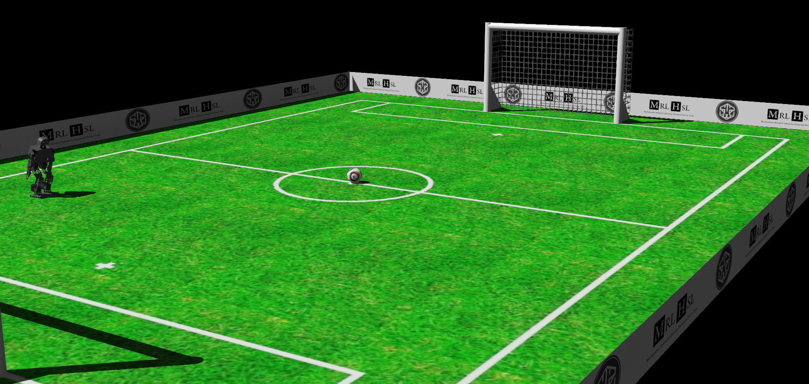

<a name="readme-top"></a>

<!-- PROJECT SHIELDS -->
<!--
*** I'm using markdown "reference style" links for readability.
*** Reference links are enclosed in brackets [ ] instead of parentheses ( ).
*** See the bottom of this document for the declaration of the reference variables
*** for contributors-url, forks-url, etc. This is an optional, concise syntax you may use.
*** https://www.markdownguide.org/basic-syntax/#reference-style-links
-->

<!--[![Contributors][contributors-shield]][contributors-url] -->
<!--[![Forks][forks-shield]][forks-url] -->
<!--[![Stargazers][stars-shield]][stars-url] -->
<!--[![Issues][issues-shield]][issues-url] -->
<!--[![MIT License][license-shield]][license-url] -->
<!-- [![LinkedIn][linkedin-shield]][linkedin-url] -->

<!-- PROJECT LOGO -->
<br />
<div align="center">
  <a href="https://github.com/othneildrew/Best-README-Template">
    
  </a>
  <h3 align="center">RoboCup-Humanoid-MRL-Webots-Simulation</h3>
</div>

<!-- TABLE OF CONTENTS -->
<details>
  <summary>Table of Contents</summary>
  <ol>
    <li>
      <a href="#Introduction">Introduction</a>
      <ul>
        <li><a href="#built-with">Built With</a></li>
      </ul>
    </li>
    <li>
      <a href="#getting-started">Getting Started</a>
      <ul>
        <li><a href="#prerequisites">Prerequisites</a></li>
<!--         <li><a href="#installation">Installation</a></li> -->
      </ul>
    </li>
    <li><a href="#usage">Usage</a></li>
<!--     <li><a href="#roadmap">Roadmap</a></li> -->
<!--     <li><a href="#contributing">Contributing</a></li> -->
<!--     <li><a href="#license">License</a></li> -->
    <li><a href="#References">References</a></li>
    <li><a href="#contact">Contact</a></li>
    <li><a href="#acknowledgments">Acknowledgments</a></li>
  </ol>
</details>


# Introduction
This is the [Webots](https://cyberbotics.com/) simulation of the [RoboCup](https://www.robocup.org/) 2019 [Humanoid Soccer League](https://humanoid.robocup.org/) Kid-Size Environment.

Also, hereby, [MRL-HSL](https://sites.google.com/view/mrl-hsl) Robot, 2019 version, is open-sourced. (done by Hamed Mahmudi)

### Built With

The project is built using Webots.
- The world and proto files are actually the developed versions of the files used in previous versions of [Webots](https://cyberbotics.com/).
- Regarding the MRL-HSL simulated robot, just note that this robot simulation is done by modifying the [Webots Robotis OP2](https://www.cyberbotics.com/doc/guide/robotis-op2?version=cyberbotics:R2019a-rev1) proto file. Also, the simulated file includes minor inaccuracies and problems that are to be resolved.

<p align="right">(<a href="#readme-top">back to top</a>)</p>

# Getting Started
(Optional)

In order to get started with this simulated environment, you can optionally learn more about the following:
- RoboCup Humanoid Soccer League Rules, 2019 Edition. ([Link](https://humanoid.robocup.org/wp-content/uploads/RCHL-2019-Rules-final.pdf))
- Webots Simulation. ([Link](https://cyberbotics.com/))

# Prerequisites
To run this simulated environment, you need to install:
- [Webots](https://cyberbotics.com/) R2023b. ([Instructions](https://www.cyberbotics.com/doc/guide/installing-webots))


<p align="right">(<a href="#readme-top">back to top</a>)</p>

# Usage

After installing Webots R2023b, You can open this environment as follows:
1. Clone the repository:
   ```sh
   git clone https://github.com/SoheilKhatibi/RoboCup-Humanoid-MRL-Webots-Simulation.git
   ```
2. Open the environment using Webots GUI, or Command line.

Webots GUI:
- Run Webots.
- File > Open World...
- Select the world file int the cloned repository.

Command line:
```sh
/path/to/webots /path/to/world/file.wbt
```

<p align="right">(<a href="#readme-top">back to top</a>)</p>

# References

- For ball texture, The texture of World Cup 2010 ball was used, by David Swart. ([Link](https://www.flickr.com/photos/dmswart/4690051366/in/photostream/))
- This ReadMe is created using [this](https://github.com/othneildrew/Best-README-Template) useful template, by [othneildrew](https://github.com/othneildrew).
- An old Logo of [Webots](https://cyberbotics.com/) was used in the texture of the walls.

<p align="right">(<a href="#readme-top">back to top</a>)</p>

<!-- CONTACT -->
# Contact

Soheil Khatibi - [Soheil Khatibi](https://www.linkedin.com/in/soheilkhatibi/) - soheilkhatibi1377@gmail.com

Project Link: [https://github.com/SoheilKhatibi/RoboCup-Humanoid-MRL-Webots-Simulation](https://github.com/SoheilKhatibi/RoboCup-Humanoid-MRL-Webots-Simulation)

<p align="right">(<a href="#readme-top">back to top</a>)</p>


<!-- ACKNOWLEDGMENTS -->
# Acknowledgments

Special Thanks to:

* [Hamed Mahmudi](https://www.linkedin.com/in/hamedmahmudi/) for designing and simulating MRL-HSL robot v2019
* [Meisam Teimouri](https://www.linkedin.com/in/meisam-teimouri-070131222/) for contributing in the project


<p align="right">(<a href="#readme-top">back to top</a>)</p>


